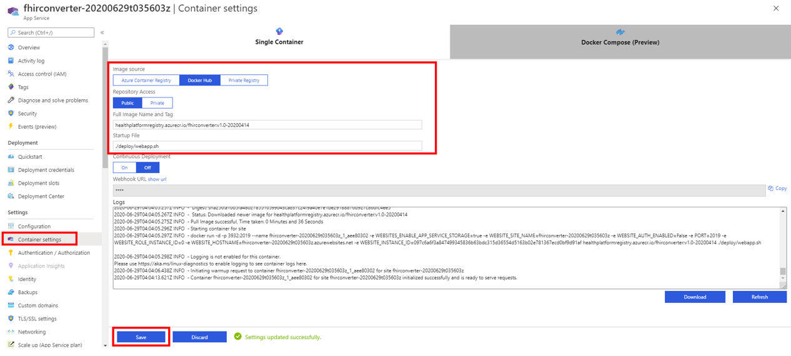

# Web UI Auto-Update Issue
There is a known issue for old installation users(v1.0), the UI will get updated automatically after restarting the converter service. Since v2.0 is not compatible with v1.0, the old installation users may have some problems using the updated UI. 

# Cause
This issue is caused by the ```latest``` tag of the docker image in the deployment template file. After v2.0 is released, the ```latest``` image is updated to the v2.0 version that supports C-CDA files and is compatible with the previous versions. When you restart the converter service, it will stop the current container and pull the updated docker image to restart. As a result, the UI of old deployments is updated to new UI automatically.

# Solution
If you encounter this issue, the solution is to rollback the container image. Since all the templates data are stored in a [persistent shared storage](https://docs.microsoft.com/en-us/azure/app-service/containers/configure-custom-container#use-persistent-shared-storage), the container image rollback will not lose your templates.

## Rollback via Azure CLI
Log in to **Azure CLI**, and type the following command
```powershell
az webapp config container set --name [ConverterAppServiceName] --resource-group [ResourceGroupName] --docker-custom-image-name "healthplatformregistry.azurecr.io/fhirconverter:1f9c0b7b11c2f7925096cece2b3d2254f527719f" --enable-app-service-storage true 
```
Then restart the container, you will see the old UI back.

## Rollback via Azure Portal
1. Sign in to **Azure Portal** and navigate to your converter service.
2. Select **Container settings**.
3. Change **Image source** to **Docker Hub** tab, then enter the **Full Image Name and Tag** and **Startup File**.
4. Click **Save** button.
5. The converter service will restart automatically. Wait 3-5 minutes, you will see the old UI back.

